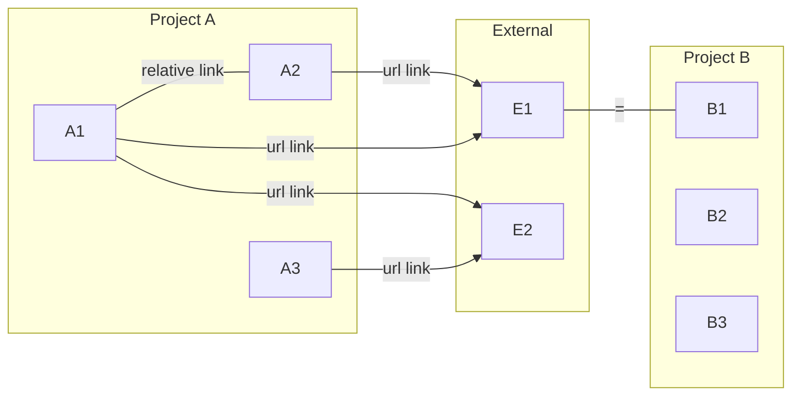
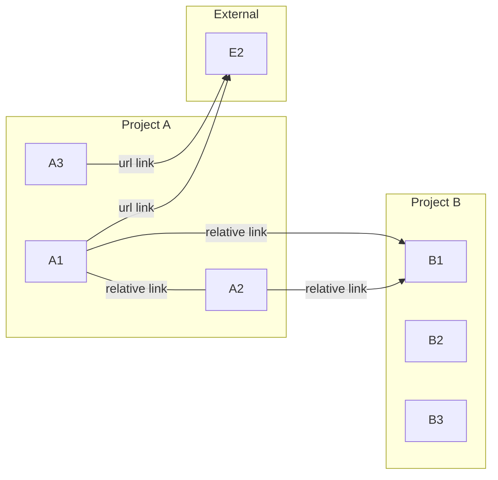

# md-graph
Generate interactive 3D network graph from markdown link relationships.

## Concept
- Parse directory of markdown projects files to build link dictionary
- Rework dictionary to build network graph
- Generate visualization 3D network graph
- Export to static HTML with links to individual files on each node.

## Linking cross-project MD files
Let's say you have a directory of markdown files that are related to each other.  You want to be able to visualize the relationships between the files.  You can do this by using relative links in the markdown files.  For example, if you have a file called ```A1.md``` and another file called ```file2.md``` in the same directory, you can link to ```A2.md``` from ```A1.md``` by using the following syntax:

```[text](A2.md)```

If you want to link to a file in a different project, you can use the following syntax:

```[text](https://path/to/E1.md)```



We assume that you have the directory `Project B`. This directory has the following files: `B1.md`, `B2.md`, and `B3.md`. If `E1.md` is in the same file as `B1.md`, the linker will assume that the link is relative (the resource will be considered as `Internal`).



## Intended Usage
- GitHub Actions build step in a static site for my personal notes
- ```python3 mdgraph/mdgraph.py```

## References
- https://regexr.com/
- pyvis - https://pyvis.readthedocs.io/
